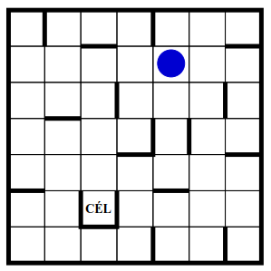

# Labyrinth

Ez a projekt a Debreceni Egyetem Szoftverfejlesztés tantárgyának keretei közt készült.

## Feladat
*Forrás: Mesterséges intelligencia feladatsor állapottér reprezentációhoz*

2.15.)

Juttassuk el a golyót a 21. ábrán látható labirintus megjelölt mezőjére! A
golyó a négy égtáj irányába mozoghat. Ha elindul valamelyik irányba, akkor
addig gurul, amíg falba vagy a pálya szélébe nem ütközik.

## Megjegyzések

A stopperóra a 'javafx-stopwatch' órai, a pom pedig a 'homework-template-project' projekten alapszik.